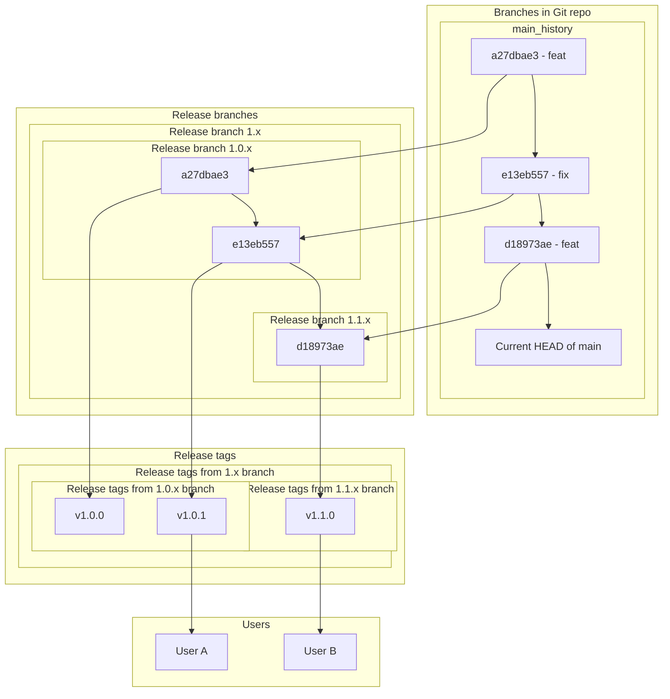
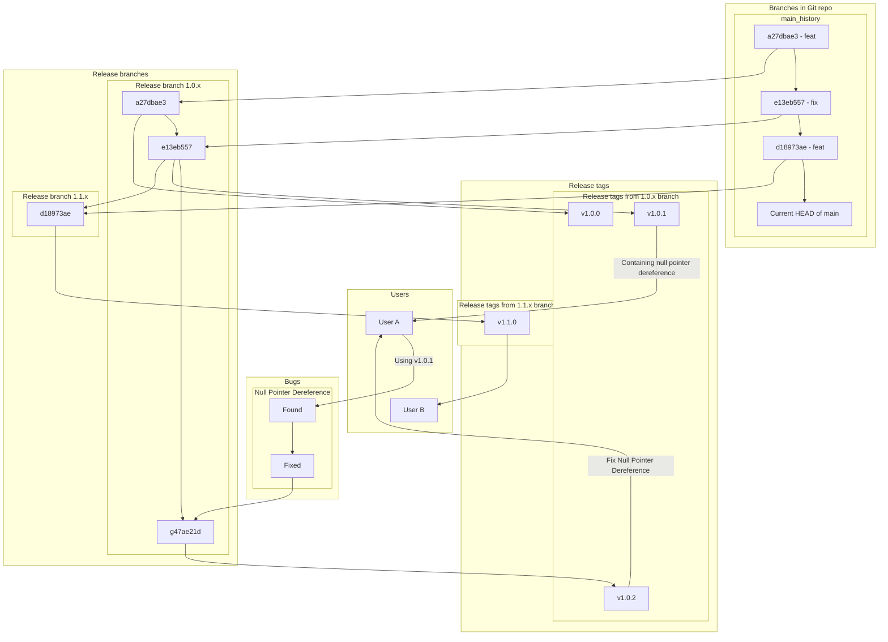
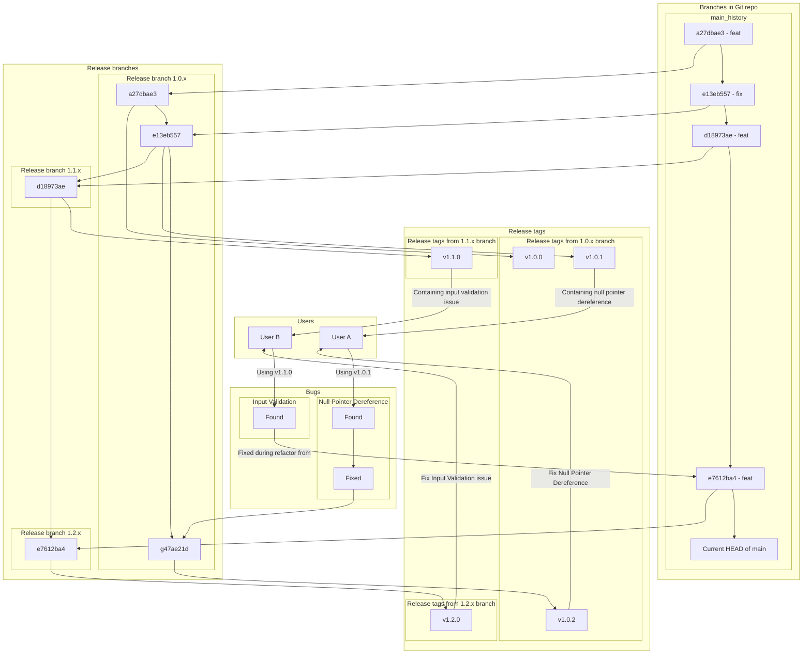

# Branching Strategy

This document is purely for educational purposes to better understand the
rational behind when new release branches are created and how and when patches
are applied to them.

Several senarios are covered to help the reader understand when new release get
created from existing branches versus when new releases get created from new
branches.

## NB

The version numbers used in this document are for example
purposes only, please see offical guidance for that the current
supported branches are.

## References

- https://trunkbaseddevelopment.com/branch-for-release/

## Basic release flow

No users, no bugs, just incrementing off main branch

## Bugfix in older supported branch

Two supported branches. 1.0.x and 1.1.x. User A is using
1.0.1 and finds a bug, the bug is no longer present in main
due to a refactor from introducing a feature (`d18973ae`) causing it
to not have been present in 1.1.0.

The user reports the bug, we root cause and implement a fix,
we apply the fix to the 1.0.x branch creating tag v1.0.2.

## New minor release

We have two branches we are supporting

- `1.1.x` is the latest and greatest. We recently saw the `v1.1.0` commit cut
  from `main~1` (`d18973ae`). A recent user, User B, has been using this
  `v1.1.0` release.

- `1.0.x` this is our stable release branch. Our initial user, User A, has been
  using this `1.0` minor version due to their usage of an unexposed API which
  was removed in main during a refactor while introducing a feature
  (`d18973ae`). We care about keeping them on as a user and therefore we
  continue to support the `1.0` branch.

User B finds a bug in `v1.1.0` which was determinted to be fixed within the
refactor that happened when we introduced a new feature in the most recent
commit to main (`e7612ba4`). We cannot create a `v1.1.1` because something we
did in the refactor while introducing the latest new feature in main made it so
that we are unable to reproduce the bug. Therefore, we cannot create a fix and
cherry-pick it to the `1.1.x` branch.

We are faced with a choice about if we want to support yet another one-off
branch for User B, similarly to what we are doing with User A, where we made
them a patch (`g47ae21d`) to fix an issue that was only in the branch their
releases come from (`1.0.x`) and had been resolved in main. Or if we want to cut
a new minor release branch off of main.

We talk to User B and they inform us they are not using any internal APIs. This
means that both our project and User B understand that when we follow Semantic
Versioning, so long as users stick to exposed API calls, we won't make changes
between minor versions which will break their calling of our exposed APIs.

We proceed to declare the `1.1.x` branch unsupported, and cut the `1.2.x`
branch off of `main` at `e7612ba4`. User B then updates their usage to pull in
the `v1.2.0` version of our software.

