# TPM Command Transmission Interface

- [What is a tcti?](#what-is-a-tcti)
- [tcti Loader](#tcti-loader)
  - [Parameters](#parameters)
- [tcti-device](#tcti-device)
  - [Parameters](#parameters-1)
- [tcti-tbs](#tcti-tbs)
- [tcti-cmd](#tcti-cmd)
  - [Parameters](#parameters-2)
- [tcti-pcap](#tcti-pcap)
  - [Parameters](#parameters-3)
- [tcti-spi-ftdi](#tcti-spi-ftdi)
- [tcti-i2c-ftdi](#tcti-i2c-ftdi)
- [tcti-spi-ltt2go](#tcti-spi-ltt2go)
- [tcti-spidev](#tcti-spidev)
- [TPM Simulator tctis](#tpm-simulator-tctis)
  - [tcti-libtpms](#tcti-libtpms)
    - [Parameters](#parameters-4)
  - [tcti-swtpm](#tcti-swtpm)
    - [Parameters](#parameters-5)
  - [tcti-mssim](#tcti-mssim)
    - [Parameters](#parameters-6)

## What is a tcti?

In a strict sense, the [TPM Command Transmission Interface
(TCTI)](https://trustedcomputinggroup.org/wp-content/uploads/TCG_TSS_TCTI_v1p0_r18_pub.pdf)
is the API for the lowest layer of the TSS. However, we are a bit sloppy with
our terminology, here, so we will call any library which implements the TCTI
just that: a _tcti_.

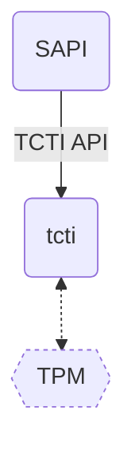

For example, the tcti-device is a library (`libtss2-tcti-device.so`) for
interacting with e.g. `/dev/tpmrm0`.

As you can see in this example, a tcti is responsible for communicating with the
TPM. Typically, it sends TPM commands to the TPM and reads responses from the
TPM (as bytes). The path to `/dev/tpmrm0` is configured via the `conf` parameter
when initializing the tcti.

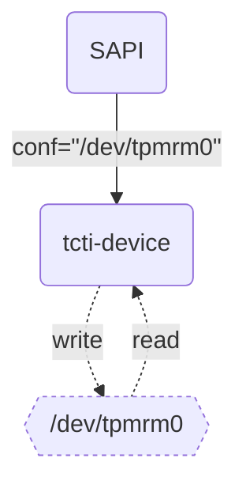

## tcti Loader

Most of the time, you will see that the TCTI is specified via a string, like
`"device:/dev/tpmrm0"` (e.g. with the
[tpm2-tools](https://github.com/tpm2-software/tpm2-tools) argument `--tcti=...`
or the [FAPI config](fapi-config.md) param `"tcti": "..."`). This indicates that
the tcti is loaded dynamically using the tctildr (tcti loader).

The tctildr is a tcti itself. It dynamically loads and configures
a tcti for you. For instance, it can load tcti-device:

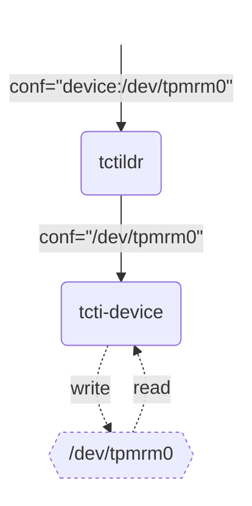

Another example for tcti-swtpm:

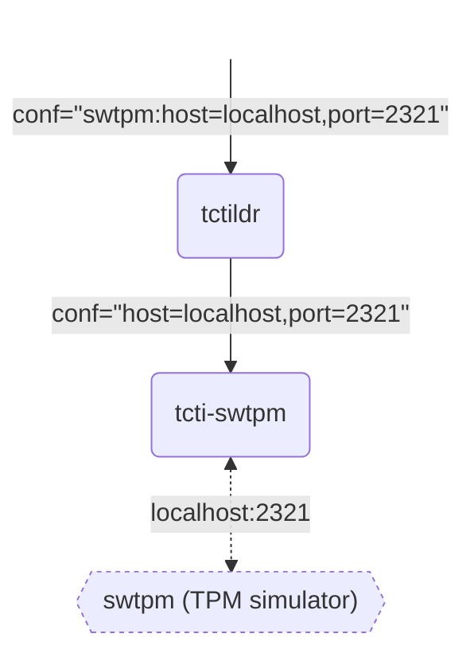

### Parameters

**`conf`**

* `<child_name>`, e.g., `device` (child_conf will be `NULL`) OR
* `<child_name>:<child_conf>`, e.g., `device:/dev/tpmrm0` OR
* `NULL`, tctildr will attempt to load a child tcti in the following order:
  1. `libtss2-tcti-default.so`
  2. `libtss2-tcti-tabrmd.so`
  3. `libtss2-tcti-device.so.0:/dev/tpmrm0`
  4. `libtss2-tcti-device.so.0:/dev/tpm0`
  5. `libtss2-tcti-device.so.0:/dev/tcm0`
  6. `libtss2-tcti-swtpm.so`
  7. `libtss2-tcti-mssim.so`

Where:

**`child_name`**

* If not empty, tctildr will try to dynamically load the child tcti library in
  the following order:
  1. `<child_name>`
  2. `libtss2-tcti-<child_name>.so.0`
  3. `libtss2-tcti-<child_name>.so`
  4. `libtss2-<child_name>.so.0`
  5. `libtss2-<child_name>.so`

**`child_conf`**

 * `conf` param to be passed to the child tcti

## tcti-device

To put it simply, tcti-device writes to and reads from a file, typically
`/dev/tpm0` or `/dev/tpmrm0` or `/dev/tcm0`. The character devices are provided by the Linux
kernel module `tpm_tis`. If no files like these are present, verify that the
kernel module is loaded (`lsmod`) and load it if necessary (`modprobe tpm_tis`).

### Parameters

**`conf`**

* path to the character device, typically `/dev/tpm0` or `/dev/tpmrm0` or `/dev/tcm0`

## tcti-tbs

The tcti-tbs is used for communicating to the TPM via the TPM Base Services
(TBS) on Windows. There might be limitations, especially if you do not have
admin rights.

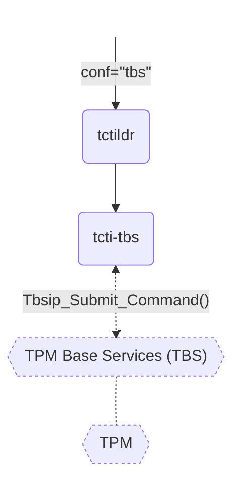

## tcti-cmd

The tcti-cmd spawns a process and connects to its `stdin` and `stdout`. This
enables some advanced shenanigans like sending TPM traffic over the network via
ssh.

The following example makes the TPM communication unnecessary complex, but shows
how tcti-cmd works. Here, commands are piped into `tpm2_send` and responses are
read from its `stdout`.

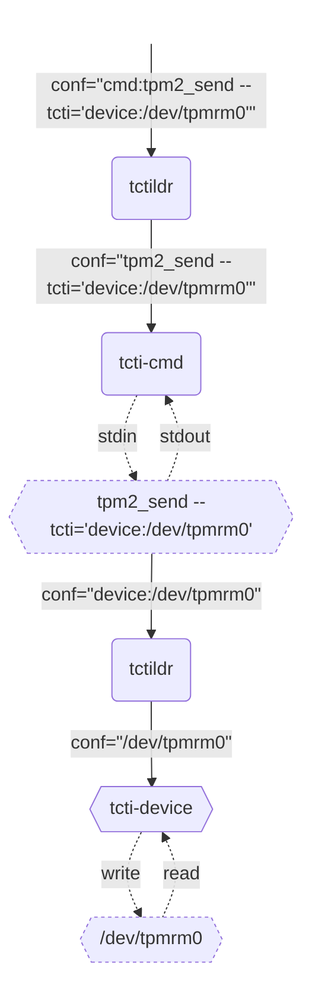

Now for a real-world example. We can communicate with a remote TPM by invoking
`tpm2_send` on another host via `ssh`.

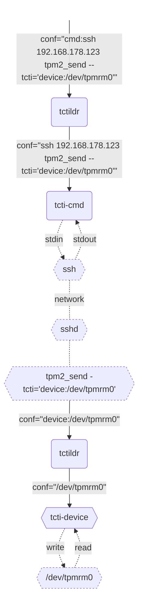

### Parameters

**`conf`**

* Command to execute. Actually, `/bin/sh -c '<conf>'` will be called.

## tcti-pcap

The tcti-pcap is used for logging. It is used by prepending any tctildr conf
string with `pcap:`, e.g. `pcap:device:/dev/tpmrm0`. Then, tcti-pcap will log into
a file specified by the environment variable `TCTI_PCAP_FILE` )(default:
`tpm2_log.pcap`). This file can be opened by e.g.
[wireshark](https://www.wireshark.org/) or
[tpmstream](https://github.com/joholl/tpmstream).

Internally, tcti-pcap delegates to tctildr, again.

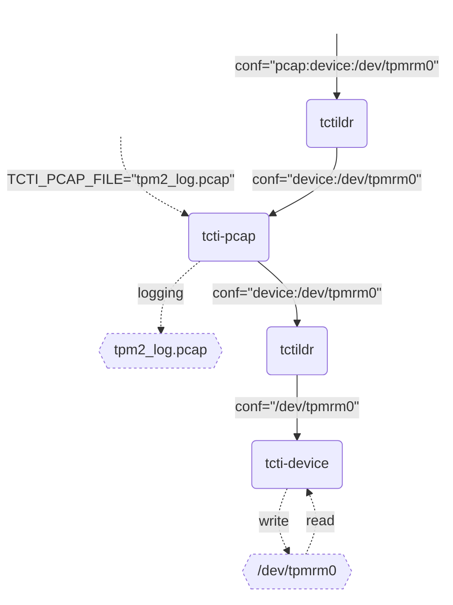

### Parameters

**`conf`**

* `conf` which will be passed to tctildr, e.g. `device:/dev/tpmrm0`

## tcti-spi-ftdi

The tcti-spi-ftdi is used for communicating with a SPI-based TPM if there is no
TPM driver present (or no OS at all).

For information, see [tcti-spi-ftdi.md](tcti-spi-ftdi.md).

## tcti-i2c-ftdi

The tcti-i2c-ftdi is used for communicating with a I2C-based TPM if there is no
TPM driver present (or no OS at all).

For information, see [tcti-i2c-ftdi.md](tcti-i2c-ftdi.md).

## tcti-spi-ltt2go

The tcti-spi-ltt2go is used specifically for communicating to the
[LetsTrust-TPM2Go](https://buyzero.de/products/letstrust-tpm2go). The
LetsTrust-TPM2Go is basically a USB stick which houses a SPI-based TPM and
connects that to the host via libusb.

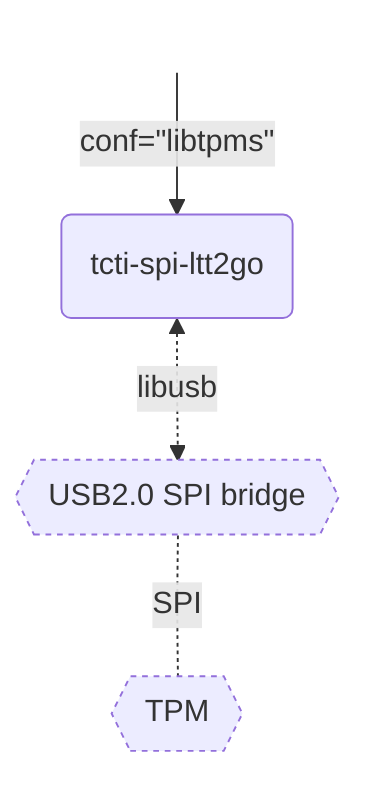

## tcti-spidev

The tcti-spidev is used for communicating to a TPM that is connected via
a spidev device. On a Raspberry Pi for example this happens when enabling
the device tree overlay `spi0-cs2`.

## TPM Simulator tctis

There are multiple tctis used for testing.

### tcti-libtpms

The tcti-libtpms is a simple TPM simulator based on
[libtpms](https://github.com/stefanberger/libtpms), a library implementing TPM
behavior. No second process is needed.

If no state file is passed via `conf`, all state is held in RAM and discarded
when the process dies.

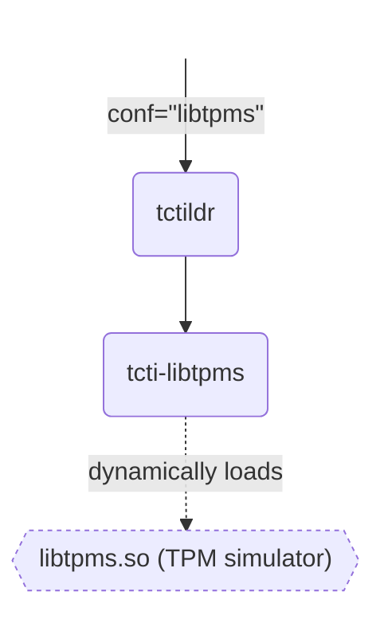

If multiple processes need to work on the simulated TPM, state must be saved to
the filesystem and loaded again. This can be achieved by passing a path via
`conf`.

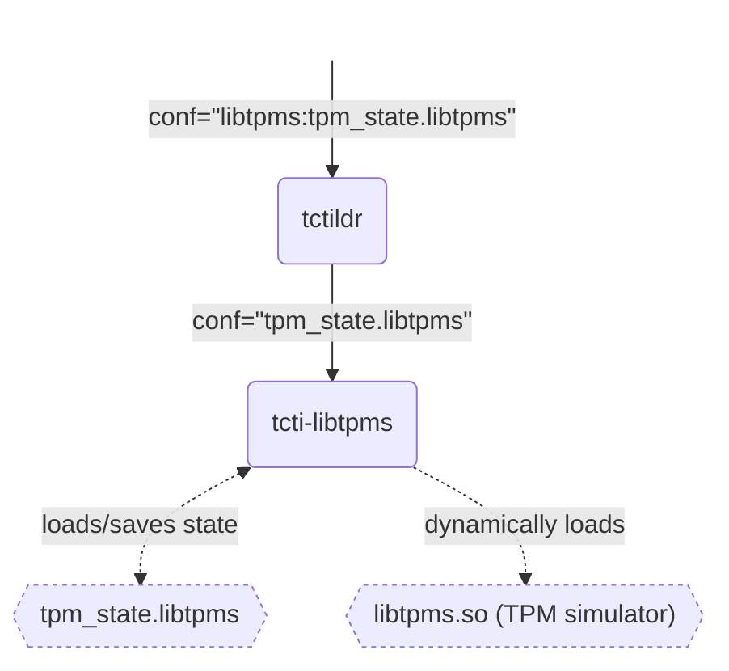

#### Parameters

**`conf`**

* Path to a state file. Will be loaded on startup or created if it does not
  exist.

### tcti-swtpm

The tcti-swtpm connects to [swtpm](https://github.com/stefanberger/swtpm), a TPM
simulator based on [libtpms](https://github.com/stefanberger/libtpms) and socket
communication.

Just like mssim, there is a primary socket (default: `2321`) used for TPM
commands/responses and a secondary socket (default: `2322`) for controlling the
simulator, here called [control
channel](https://github.com/stefanberger/swtpm/wiki/Control-Channel-Specification).
While the primary socket is identical with that of mssim, the secondary one is
incompatible.

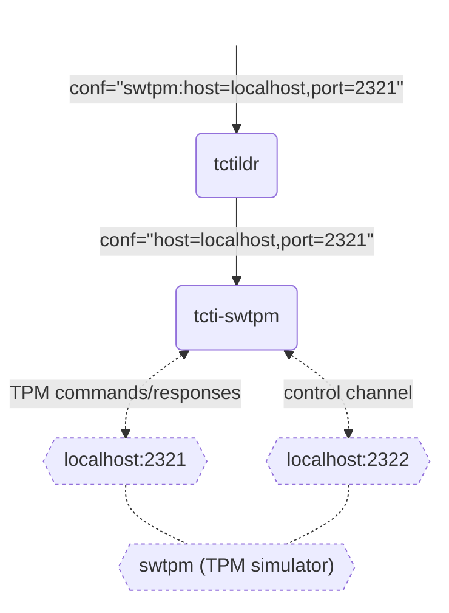

#### Parameters

**`conf`**

* `host=<host>,port=<port>`, e.g., `host=192.168.178.123,port=5000`
* `host=<host>`, e.g., `host=192.168.178.123`
* `port=<port>`, e.g. `port=5000`

Where:

**`host`**

 * Hostname or IP address to the simulator, default: `localhost`

**`port`**

* Port to the simulator, default: `2321`. The control channel will be `<port> + 1`

### tcti-mssim

The tcti-mssim connects to the Microsoft TPM simulator
[mssim](https://github.com/microsoft/ms-tpm-20-ref), [repackaged by
IBM](https://sourceforge.net/projects/ibmswtpm2/).

Like with swtpm, there is a primary socket (default: `2321`) used for TPM
commands/responses and a secondary socket (default: `2322`) for sending
so-called *platform commands* which control the simulator. While the primary
socket is identical with that of swtpm, the secondary one is incompatible.

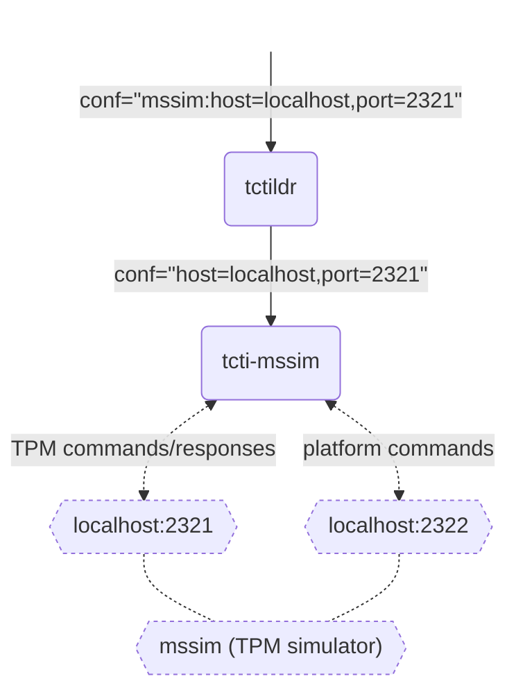

#### Parameters

**`conf`**

* `host=<host>,port=<port>`, e.g., `host=192.168.178.123,port=5000`
* `host=<host>`, e.g., `host=192.168.178.123`
* `port=<port>`, e.g. `port=5000`

Where:

**`host`**

 * Hostname or IP address to the simulator, default: `localhost`

**`port`**

* Port to the simulator, default: `2321`. The control channel will be `<port> +
  1`
